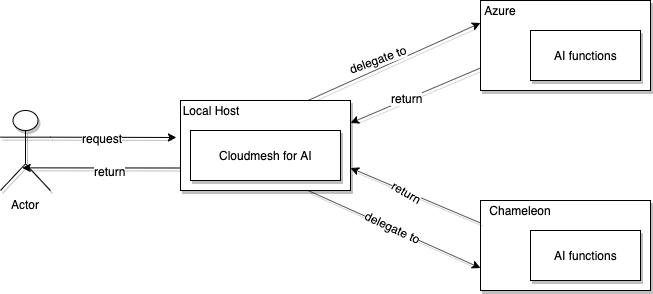

# Cloudmesh Cloud AI Service

* [Qiwei Liu, hid 151](https://github.com/cloudmesh-community/fa19-516-151/graphs/contributors), 
* [Yanting Wan, hid 170](https://github.com/cloudmesh-community/fa19-516-151/graphs/contributors)
* Gregor von Laszewski

Link to the project: <https://github.com/cloudmesh/cloudmesh-analytics>

Link to the manual: <https://github.com/cloudmesh/cloudmesh-analytics/blob/master/manual.md>

The cloudmesh Cloud Ai service will provide AI capabilities that are
running on the different cloud, e.g. chamelon, azure. For the example
functions, linear regression, principle components analysis and so on
will be provided so that users can utilize the computing power of the
clouds to train their models. The cloudmesh cloud AI service will
administrate  multiple clouds and determine which cloud to use for
scheduled tasks.


## Architecture Design



The architecture primarily contains four objects:

* User which is the actor

* The application running on local host using cloudmesh  will manipulate
  multiple cloud instance, decides delegate computational tasks to which
  cloud

* The AI services will be running on the Azure or chameleon cloud,
  exposing APIs to incoming requests, and return the return the result
  to the local host

## Implementation

### Technologies Used

| Section          | Content                                                      |
| ---------------- | ------------------------------------------------------------ |
| Operating System | Mac OS, Ubuntu                                               |
| OpenAPI          | The REST API will be defined by using OpenAPI specification  |
| Swagger editor   | The swagger editor is used to write API documentation based on the OpenAPI standard |
| Flask            | The web application framework that handles incoming requests |
| Connexion        | Connexion is an application on the top of Flask that will map the REST API documentation to python functions on Flask |
| Pytest           | will be the testing framework                                |


### Docker

Use docker without typing sudo

```sh
# add docker group
$ sudo group add docker
# add user to docker group
$ sudo gpasswd -a myusername docker
# restart docker
$ sudo service docker restart
$ exit
```
